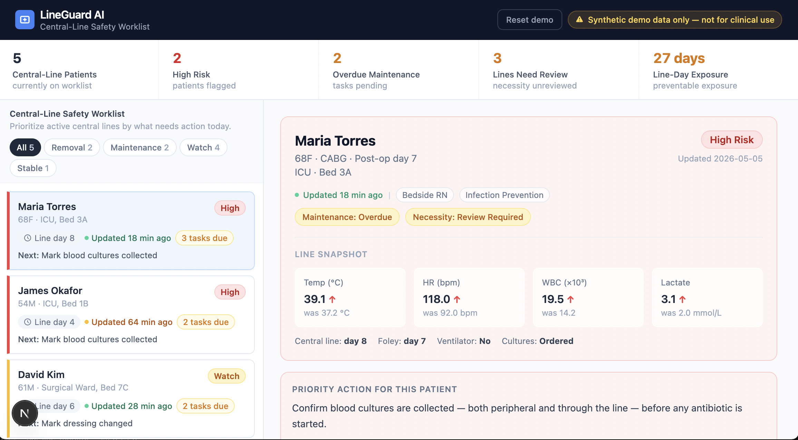
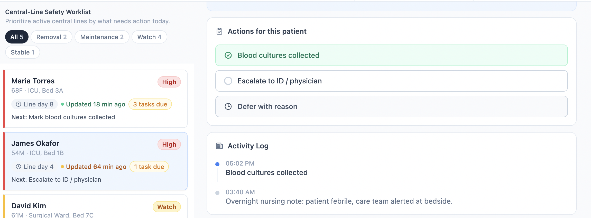
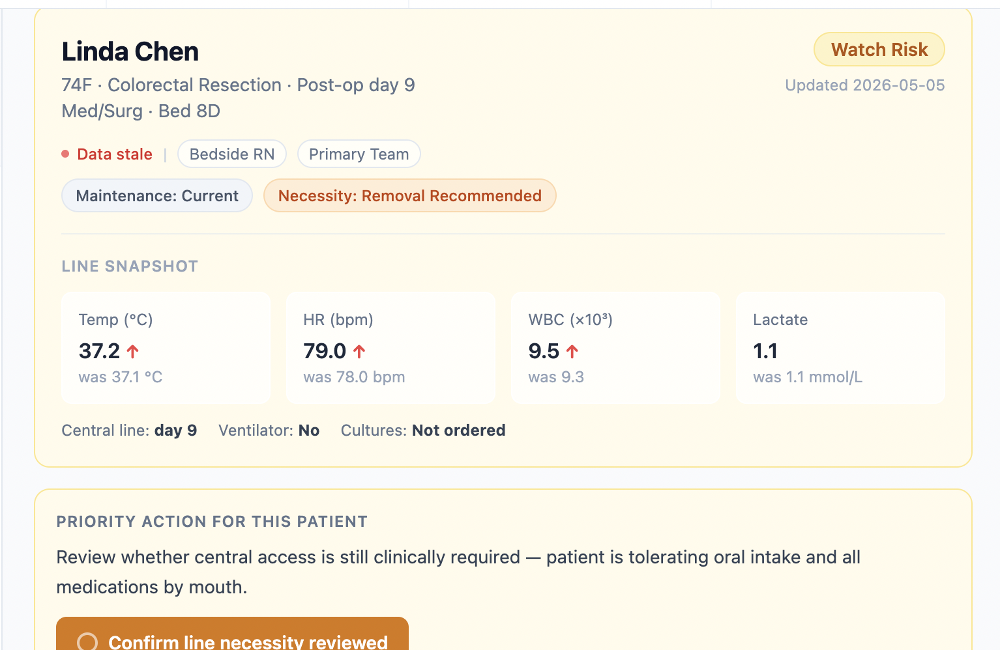
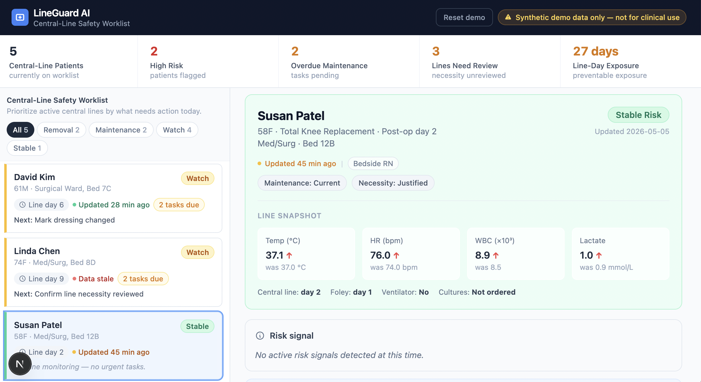

# LineGuard AI Showcase

LineGuard AI is an early healthcare AI prototype focused on central-line safety, infection prevention, patient safety, and clinical workflow support.

The project explores how agent-powered tools can help healthcare teams move from fragmented clinical signals to clearer, action-ready workflows.

## What It Does

LineGuard AI organizes synthetic patient worklist data into a central-line safety view that helps surface:

- Patients who may need review
- Overdue maintenance tasks
- Line necessity concerns
- Escalation and follow-up actions
- Documentation and activity history

The prototype is designed around a practical workflow question: once a risk or care gap is identified, how can teams act faster, with clearer context, and less fragmented follow-up?

## Focus Areas

- Infection prevention workflow support
- Central-line safety monitoring
- Patient safety operations
- Clinical task prioritization
- Action-oriented workflow design
- Synthetic demo scenarios for early validation

## Prototype Preview

The screenshots below show selected views from the current LineGuard AI prototype using synthetic demo data only. This public showcase is intentionally high-level while the full working prototype remains private during active development.

### Dashboard Overview

### Risk Workflow

### Line Necessity Review

### Low-Risk Patient View

## Demo Walkthrough

Demo walkthrough coming soon.

<!-- After recording Loom, replace the line above with:
A short demo walkthrough is available here: [Watch demo](PASTE_LOOM_LINK_HERE)
-->

## Current Status

This is an early prototype built for rapid iteration, feedback, and demonstration. The current version uses synthetic demo data and is not intended for clinical use.

## Data and Safety Note

This project uses synthetic/demo data only. No real patient data, hospital data, protected health information, or clinical records are included.

## IP / Code Access

This public repository is a high-level showcase. The full working prototype, implementation details, agent logic, and private development files are kept private while the project is under active development.

## Demo Walkthrough

A short demo walkthrough is available here: [Watch demo](https://www.loom.com/share/631b9a51e0544302b38eb97044810465)
